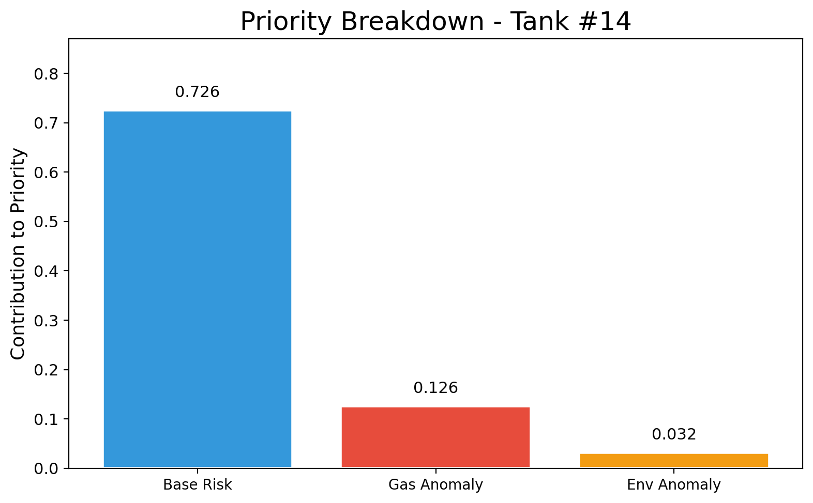
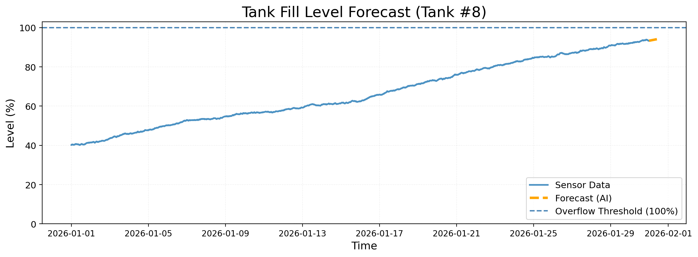

# RASD: Quantum-Optimized Sanitation Routing System for Palestine

<p align="center">
  
</p>

<p align="center">
  <strong>🏆 NYUAD Hackathon 2026 Project</strong><br/>
  Smart Waste Collection Management using IoT, AI, and Quantum Computing
</p>

<p align="center">
  
  
  
  
</p>

---

## 📋 Table of Contents

- [Problem Statement](#-problem-statement)
- [Solution Overview](#-solution-overview)
- [Key Features](#-key-features)
- [System Architecture](#-system-architecture)
- [Installation](#-installation)
- [Usage](#-usage)
- [Project Structure](#-project-structure)
- [Technology Stack](#-technology-stack)
- [Team](#-team)
- [License](#-license)

---

## 🎯 Problem Statement

In Hebron, Palestine, waste management faces critical challenges:

- **Unpredictable Tank Overflow**: Septic tanks fill at variable rates, leading to emergency situations
- **Inefficient Routes**: Collection trucks follow static schedules, wasting fuel and time
- **Road Closures**: Dynamic road restrictions complicate route planning
- **Environmental Hazards**: Overflow events cause health risks and environmental contamination
- **Resource Constraints**: Limited trucks and tight budgets demand optimal utilization

**RASD** addresses these challenges by combining IoT sensors, AI forecasting, and quantum optimization to create a smart, adaptive waste collection system.

---

## 💡 Solution Overview

RASD (Arabic: رصد, meaning "Monitor") is an end-to-end intelligent sanitation management platform:

1. **IoT Monitoring**: Simulates ultrasonic level sensors, gas detectors, and environmental sensors
2. **AI Forecasting**: Prophet-based time-series forecasting predicts Time-To-Overflow (TTO)
3. **Risk Fusion**: Multi-factor risk scoring combines fill levels, gas anomalies, and environmental data
4. **Quantum Optimization**: D-Wave Ocean SDK simulated annealing for vehicle routing optimization
5. **Real-time Dashboard**: React-based operations center for municipality workers

---

## ✨ Key Features

### 🔮 Predictive Analytics
- **Prophet Forecasting**: 72-hour fill level predictions per tank
- **Anomaly Detection**: Robust Z-score based gas and environmental spike detection
- **Priority Scoring**: Multi-weighted risk fusion (TTO + fill level + anomalies)
- **Tier Classification**: HIGH / MEDIUM / LOW priority assignment

### 🚛 Route Optimization
- **Baseline Greedy**: Classical heuristic routing for comparison
- **Quantum Annealing**: Simulated quantum optimization using D-Wave Ocean SDK
- **Constraint Handling**: Truck capacity, shift duration, road closures, narrow streets
- **Multi-Objective**: Minimize distance while maximizing high-priority tank coverage

### 📊 Operations Dashboard
- **Interactive Map**: Real-time tank status with color-coded risk tiers
- **Truck Animation**: Uber-like smooth truck movement along routes
- **Drain Simulation**: Visual tank draining animation when trucks arrive
- **Arabic/English**: Full RTL Arabic support with Cairo font
- **Mobile Responsive**: Works on desktop and mobile devices

### 📈 KPI Tracking
- **Distance Metrics**: Total kilometers, fuel consumption, CO₂ emissions
- **Coverage Metrics**: Tanks served by tier (HIGH/MEDIUM/LOW)
- **Workload Balance**: Stops per truck distribution
- **Cost Estimation**: Fuel cost projections

---

## 🏗️ System Architecture

```
┌─────────────────────────────────────────────────────────────────┐
│                        RASD Architecture                         │
├─────────────────────────────────────────────────────────────────┤
│                                                                  │
│  ┌──────────────┐    ┌──────────────┐    ┌──────────────┐       │
│  │  IoT Sensors │───▶│  AI Engine   │───▶│  Optimizer   │       │
│  │  (Simulated) │    │  (Prophet)   │    │  (Quantum)   │       │
│  └──────────────┘    └──────────────┘    └──────────────┘       │
│         │                   │                   │                │
│         ▼                   ▼                   ▼                │
│  ┌──────────────────────────────────────────────────────┐       │
│  │                   Data Pipeline                       │       │
│  │  mock_hebron.csv → priorities.csv → routes.json      │       │
│  └──────────────────────────────────────────────────────┘       │
│                              │                                   │
│                              ▼                                   │
│  ┌──────────────────────────────────────────────────────┐       │
│  │              React Frontend Dashboard                 │       │
│  │     Leaflet Maps • Recharts • Framer Motion          │       │
│  └──────────────────────────────────────────────────────┘       │
│                                                                  │
└─────────────────────────────────────────────────────────────────┘
```

---

## 🚀 Installation

### Prerequisites

- Python 3.10 or higher
- Node.js 18+ and npm (for frontend)
- Git

### Backend Setup

1. **Clone the repository**
   ```bash
   git clone https://github.com/your-username/RASD_NYUAD.git
   cd RASD_NYUAD
   ```

2. **Create virtual environment**
   ```bash
   python -m venv .venv
   
   # Windows
   .venv\Scripts\activate
   
   # Linux/Mac
   source .venv/bin/activate
   ```

3. **Install dependencies**
   ```bash
   pip install -r requirements.txt
   ```

4. **Install package in development mode**
   ```bash
   pip install -e .
   ```

### Frontend Setup

```bash
cd src/rasd_ai/frontend
npm install
```

---

## 📖 Usage

### Run Complete Pipeline

Execute all 7 pipeline steps (simulation → forecasting → optimization → visualization):

```bash
cd src
python -m rasd_ai.run_pipeline --demo
```

This will:
1. Generate mock sensor data (`mock_hebron.csv`)
2. Run Prophet forecasting + risk fusion (`priorities.csv`)
3. Generate routing inputs (nodes, trucks, travel matrix)
4. Build baseline routes (greedy heuristic)
5. Solve with quantum annealing simulation
6. Generate visualization plots
7. Export data for frontend

### Run Individual Modules

```bash
# Generate routing inputs only
python -m rasd_ai.optimization.routing_inputs

# Build baseline routes
python -m rasd_ai.optimization.baseline_greedy

# Run quantum optimizer
python -m rasd_ai.optimization.quantum_anneal

# Generate visualizations
python -m rasd_ai.viz.plots
```

### Launch Frontend Dashboard

```bash
cd src/rasd_ai/frontend
npm run dev
```

Open `http://localhost:5173` in your browser.

### Build Frontend for Production

```bash
cd src/rasd_ai/frontend
npm run build
```

Deploy the `dist/` folder to Netlify, Vercel, or any static host.

---

## 📁 Project Structure

```
RASD_NYUAD/
├── README.md                 # This file
├── requirements.txt          # Python dependencies
├── pyproject.toml           # Package configuration
├── setup.py                 # Setuptools configuration
│
└── src/
    └── rasd_ai/
        ├── __init__.py
        ├── run_pipeline.py      # Main orchestrator
        │
        ├── config/              # Configuration
        │   ├── paths.py         # Centralized file paths
        │   └── settings.py      # Constants and thresholds
        │
        ├── data/                # Data utilities
        │   ├── loaders.py       # JSON/CSV/NPY loading
        │   └── schemas.py       # Dataclasses
        │
        ├── simulation/          # Data simulation
        │   └── hebron.py        # Hebron city simulator
        │
        ├── forecasting/         # AI forecasting
        │   └── prophet_model.py # Prophet TTO prediction
        │
        ├── risk/                # Risk assessment
        │   ├── anomalies.py     # Anomaly detection
        │   └── fusion.py        # Risk score fusion
        │
        ├── optimization/        # Route optimization
        │   ├── routing_inputs.py    # Input generation
        │   ├── baseline_greedy.py   # Classical heuristic
        │   ├── quantum_anneal.py    # Quantum solver
        │   └── metrics.py           # KPI computation
        │
        ├── viz/                 # Visualization
        │   ├── plots.py         # Matplotlib charts
        │   └── map_routes.py    # Route comparison
        │
        ├── exporters/           # Data export
        │   └── frontend.py      # Frontend JSON builder
        │
        ├── outputs/             # Generated outputs
        │   ├── *.json, *.csv, *.png
        │
        └── frontend/            # React dashboard
            ├── src/
            ├── public/
            └── package.json
```

---

## 🛠️ Technology Stack

### Backend
| Technology | Purpose |
|------------|---------|
| **Python 3.10+** | Core programming language |
| **Prophet** | Time-series forecasting |
| **D-Wave Ocean SDK** | Quantum annealing optimization |
| **NumPy / Pandas** | Data processing |
| **Matplotlib** | Visualization generation |

### Frontend
| Technology | Purpose |
|------------|---------|
| **React 18** | UI framework |
| **TypeScript** | Type-safe JavaScript |
| **Vite** | Build tool |
| **Tailwind CSS** | Styling |
| **Leaflet** | Interactive maps |
| **Recharts** | Data visualization |
| **Framer Motion** | Animations |

### DevOps
| Technology | Purpose |
|------------|---------|
| **Git** | Version control |
| **Netlify** | Frontend hosting |
| **Black** | Code formatting |
| **Pylint** | Code quality |

---

## 📊 Sample Outputs

### Priority Dashboard


### Route Comparison


### Forecast Visualization


---

## 👥 Team

**RASD Team** - NYUAD Hackathon 2026

---

## 📄 License

This project is licensed under the MIT License - see the [LICENSE](LICENSE) file for details.

---

## 🙏 Acknowledgments

- **NYU Abu Dhabi** for hosting the hackathon
- **D-Wave Systems** for quantum computing resources
- **Meta** for the Prophet library
- **OpenStreetMap** for map data

---

<p align="center">
  <strong>Built with ❤️ for Palestine</strong>
</p>
